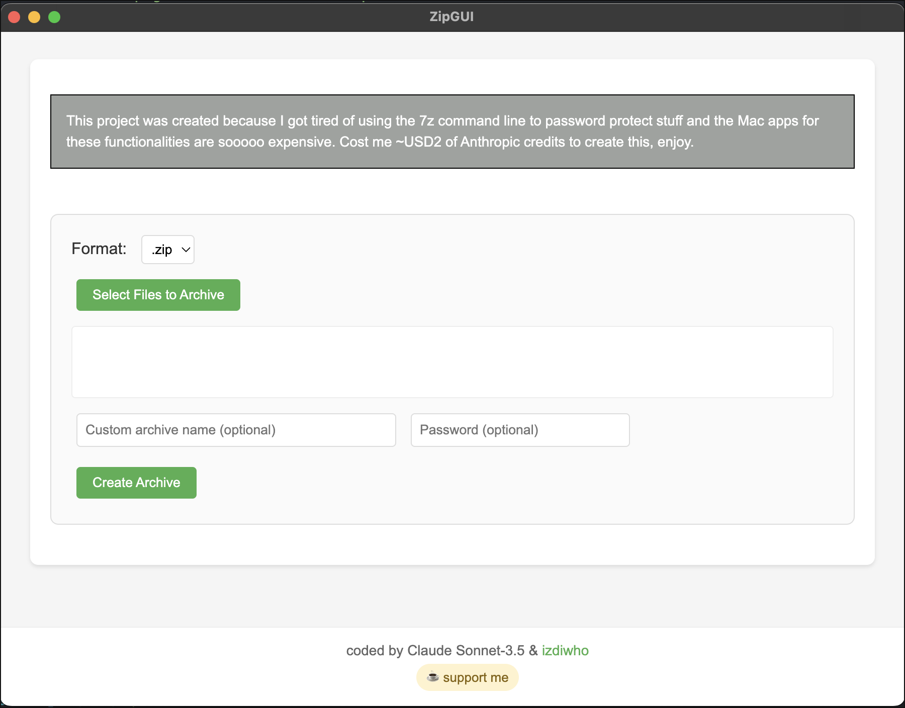

# 7ZipGUI

A simple GUI wrapper for 7-Zip on macOS. Created using Electron and Claude Sonnet-3.5.



## Features
- Create .7z and .zip archives
- Password protect archives
- Custom naming options
- Simple and intuitive interface
- Native macOS experience

## Requirements
- macOS
- [7-Zip](https://www.7-zip.org/) (p7zip)

## Build It Yourself

1. Install Requirements:
```bash
# Install Homebrew if you haven't
/bin/bash -c "$(curl -fsSL https://raw.githubusercontent.com/Homebrew/install/HEAD/install.sh)"

# Install Node.js
brew install node

# Install 7-Zip
brew install p7zip
```

2. Clone & Build:
```bash
# Clone repository
git clone https://github.com/izdiwho/7ZipGUI.git
cd 7ZipGUI

# Install dependencies
npm install

# Run in development
npm start

# Build the app
npm run build

# The built app will be in the 'dist' folder
```

3. Optional: Create your own DMG
```bash
# Install create-dmg
npm install -g create-dmg

# Create DMG from the built app
create-dmg "dist/mac/7Zip GUI.app" dist/
```

## Development

```bash
# Install dependencies
npm install

# Run the app
npm start

# Build the app
npm run build
```

## Development Notes

- The app uses Electron for the GUI
- 7-Zip (p7zip) is required for compression functionality
- Built files are not signed or notarized
- You may need to allow the app in System Preferences > Security & Privacy

## Why?

This project was created because I got tired of using the 7z command line to password protect stuff and the Mac apps for these functionalities are sooooo expensive. Cost me ~USD2 of Anthropic credits to create this, enjoy.

## Common Issues & Solutions

### App Can't Be Opened
Since the app isn't signed when you build it yourself, macOS might prevent it from running. To fix this:

1. Right-click the app and select "Open"
2. Click "Open" in the security dialog
3. The app should now run normally

### 7-Zip Not Found
Make sure 7-Zip is installed and in your PATH:
```bash
# Check 7-Zip installation
which 7z

# If not found, install it
brew install p7zip
```

## Support

☕ [Buy me a coffee](https://buymeacoffee.com/izdiwho/)

## Credits

- Created by [Claude](https://anthropic.com/claude) & [izdiwho](https://izdiwho.com)
- Uses [7-Zip](https://www.7-zip.org/) for compression